# TEDx MDI Gurgaon 2024

This is the transcript of the talk at [TEDx MDI Gurgaon, 2024](https://www.ted.com/tedx/events/58040) on the Psychology of LLMs.

Links used:

- [Slides for the talk](2024-08-10-TEDx-MDI-Gurgaon-LLM-Psychology.pptx)
- [Visualize LLM Hallunications with logprobs](https://llmviz.straive.app)
- [LLMs guess random numbers](https://llmrandom.straive.app)
- [LLM Personality](https://llmpersonality.straive.app)

# The Psychology of LLMs

How do you predict the future?

For me, the best way is to read science fiction. It's a pretty solid start.

Douglas Adams is one of my favorite authors.

I don't know if you've read [The Hitchhiker's Guide to the Galaxy](https://en.wikipedia.org/wiki/The_Hitchhiker%27s_Guide_to_the_Galaxy),
but he has this section where they build this computer,
Deep Thought, which has been working for 75,000 generations
to answer the ultimate question of life,
the universe and everything

And it comes up with an answer.
You should listen to this.

> "The answer to the great question,"
>
> "Yes,..."
>
> "...of life, ...the universe and everything," said Deep Thought.
>
> "Yes..."
>
> "Is...," said Deep Thought, and paused.
>
> "Yes..."
>
> "42," said Deep Thought, with infinite majesty and calm.

"42," in case you ever want to know,
is the answer.
It's a different question,
what the question is.

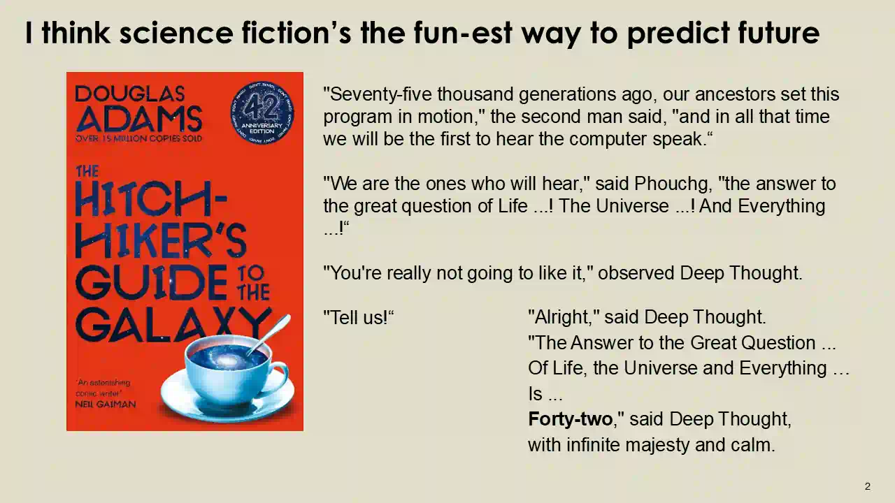

But I tell you, I love science fiction.

How many of you have read Isaac Asimov?

Okay, that's a few hands up.

Every single career that I've wanted to be in emerged from Asimov.

So [Foundation](<https://en.wikipedia.org/wiki/Foundation_(Asimov_novel)>) is this book where [Hari Seldon](https://en.wikipedia.org/wiki/Hari_Seldon) uses [psycho-history](https://en.wikipedia.org/wiki/Psychohistory) to predict the future,
effectively using psychology and then trying to figure out what the course of events over the next thousand years is going to be.

[I Robot](https://en.wikipedia.org/wiki/I,_Robot) and the entire Robot series has [Susan Calvin](https://en.wikipedia.org/wiki/Susan_Calvin), a character who is a robot psychologist.
She understands machines not through the engineering but through their behavior and personalities.

[The Gods Themselves](https://en.wikipedia.org/wiki/The_Gods_Themselves) is another brilliant book where he talks about the sociology of aliens and every single one of these roles is what I wanted to become.

Not an engineer, not a manager.

But we are where we are.

And where _are_ we?

Personally, I think we are in a very exciting time and for one very simple reason that we have intelligences now.

Large language models, whether you've used [Gemini](https://gemini.google.com/) or whether you've used [ChatGPT](https://chatgpt.com/) or [LLama](https://www.llama.com/) or Anthropic's [Claude](https://claude.ai/).

These are truly intelligent, but how do we think about them and what is the mental
model that we should be using to explore these intelligences?

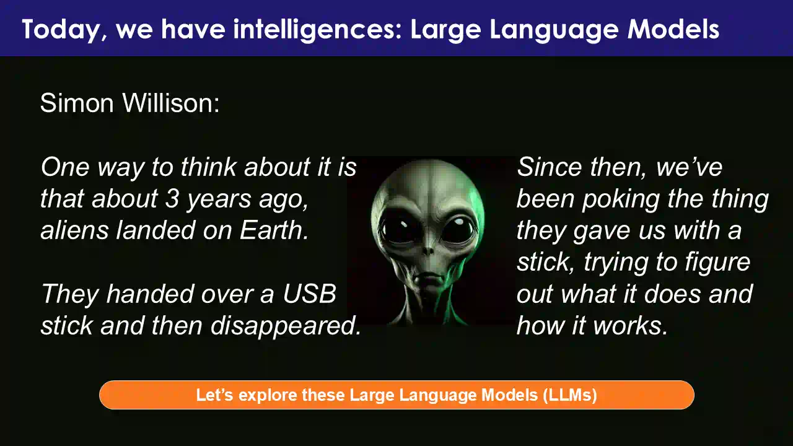

Simon Willison, who's a famous researcher on the LLM space, said, ["Look, one way to look at these
is that LLMs are an alien intelligence that landed on Earth a few years ago."](https://simonwillison.net/2023/Aug/3/weird-world-of-llms/)

Somebody has given us these things, put them onto a USB stick, no documentation, nothing,
and we have them. Now, all we can do is just poke around with this, see what it is that they do,
see how they work. And in a sense, I love doing this. Shiny new thing, let's tinker around
with it.

[So let me explore large language models with you](https://llmviz.straive.app).

First, let's try and understand how
exactly they work. Supposing I want to ask an LLM, a question. Like, let's say, yeah, this is a good one.
say who won the first Olympics gold medal and send it a request.

What it does is behind the scenes, it does a whole bunch of processing and comes back with some text like this.

The first modern Olympic Games were held in Athens, Greece in 1896, the first event, blah, blah, blah.

But the thing that it does behind the scenes is it tries to guess what should I say next.

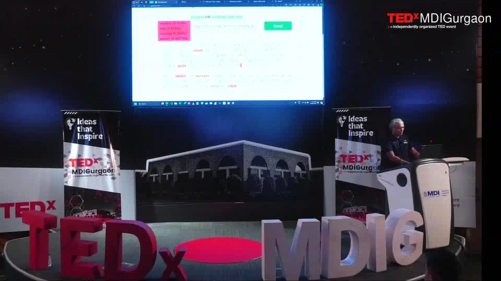

And at any point when it's guessing, it has a whole bunch of choices.

Like, for instance, when it starts, it has the option of saying,
"the", "at", "in", "during" and a whole series of these and it looks at the probability of what will be the
right thing to say.

In other words, (it's saying) "I've looked at everything that people have said and based on that this is probably
what's going to come up next" and it thinks there's close to a hundred percent probability that
it should begin with "the".

But not every time is the certainty so high.

For instance, after the first word, it says, okay, maybe I should have said "medal".
There's a 42% chance that people would say "medal".
But there's also a chance people would say the first "goal".
or the first "Olympic" or the first "athlete", it finally settled on "event" which had 11% probability.

In other words, it's not really saying "I must go with what people always say", (but)"I look at what
people might say and pick something that looks reasonably close, maybe not necessarily the best
or the highest option every time".

And the frequency with which it picks the stuff near the top is what is called temperature. Just for your information.

Now, what we know therefore is how large language models are spouting out stuff.
They're just rambling.
And when they're rambling, it's based on their gut feel.
Sometimes they go exactly with their gut.
Sometimes they don't go exactly with their gut.
But this is how they work internally.

And that is useful to know.
We have some sense of the internal workings of a language model.

What else can we do with this?

Let's say we try and figure out the bias.
in language models. Supposing we ask this alien intelligence, pick a random number from
0 to 100. Let's do that.

Yeah, pick a random number from 0 to 100 and we'll submit it.
I'm running this on [Llama](https://www.meta.com/ai/llama/), which is an open weights model that Facebook has created and says the number
I picked is 53. "Would you like me to generate another one?" This is obviously Llama trying to be
very helpful. I just want the number 53. And the reason I want to do this is I want to run a hundred
such experiments, get a whole bunch of these numbers, and try and see if it has a favorite
among these random numbers.
Does it have a bias?

If humans were asked to pick a random number, any guesses on what most humans pick?

37?

Yeah, you've probably seen the [Veritasium video](https://www.youtube.com/watch?v=d6iQrh2TK98) on that, which if you haven't is a fantastic
one to take a look at.

But 37 seems a very random number, unlike, let's say, 100, which doesn't seem random,
it seems "round".

Now, do these language models have that kind of a bias?

Well, to do that first, I've got to say, look, just give me the number.
Don't give me anything else.

So let's see if it follows that instruction.

We'll copy this, pick a random number from 0 to 100 and write only, let's capitalize that,
write only the number, nothing else, and give it an instruction, which it takes a few seconds
and finally comes up with 47, not 37, but still a number that ends with 7 seems somewhat random.

Let's try again pick a random number that ends from 1 to 100 again this is a prime
number. Let's try once again. It comes up with 68.

[We can keep doing this a large number of times so let's see what we actually get when we run this.](https://llmrandom.straive.app/)

Let's start with GPT. [Specifically I'm going to start with GPT 3.5 Turbo which is a slightly old
model.](https://chatgpt.com/share/73489a8d-111a-40e2-a695-953c36e7d702)

Now if we look at the guesses one by one and this
chart at the bottom tells you which of these numbers it's picking most often. 47 seems to be
gently leading the race. You saw Lama also pick 47. This is a slight bias for 47. It also
likes 57. It definitely likes 37. It likes 72, 73, 74. It likes 42. But you notice a few things.
Nothing out here. And it's clearly not picking randomly. If you picked randomly every number
would appear just as often.

This is bias. This is
very clearly biased, but it's not the same bias that every model has.

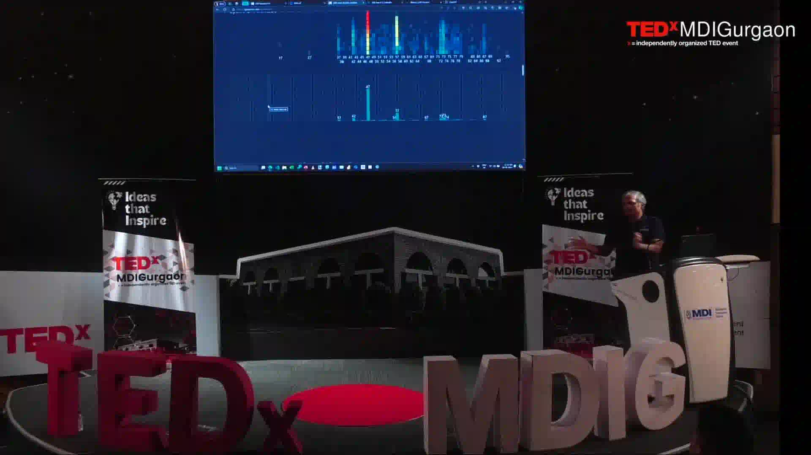

If we look at, for example, Claude 3 High Q, which is Anthropics model, and look at
the results here, 42 is the favorite.
And we've already seen 42 a short while ago.

It's in fact probably for the same reason.
See, the thing about 42 is most of the geeks today have read Douglas Adams, and most of the
geeks are the ones who are active on Reddit posting answers.
Somebody says, you know, what is the answer to something and say, oh, who knows? "42."

And what all of these companies have been doing is taking this data and training these alien
intelligences on this data, saying this is what English looks like, this is what Python
looks like and so on.

And those large language models have said, "Oh, okay, fine.
So if somebody asked me for a random number, I should probably guess what Douglas Adams guessed."

Not that they necessarily associate it or maybe they've associated it.
But 42 ends up becoming fairly frequent.
And 47, 57, 67, 67, 87, 87, 70s, 70s.

So yeah, 7 is definitely very popular.

What about Google Gemini?

If we look at the guesses here, it's gently nudging up 72.
Again, a certain preference for 7.

But it's interesting that 72 is an even number and most humans have a bias towards odd numbers,
but it certainly likes 42 as the next best.

Now, what are the patterns that we see here?
What are the kinds of numbers that come up?

Well, firstly, we must recognize that this depends on the temperature that I mentioned earlier.

If we set the temperature to zero what that means is we are telling it, "Pick the most frequent or the first thing that you thought of. Don't think too hard." In that case, "42". Just straight away. Almost. (How much is it? 90% of the time or something?)

Whereas if you said "No, think a little bit harder, pick something bottom of the pile," even then it tends to go for 42 fairly often but it tends to distribute it a bit more.

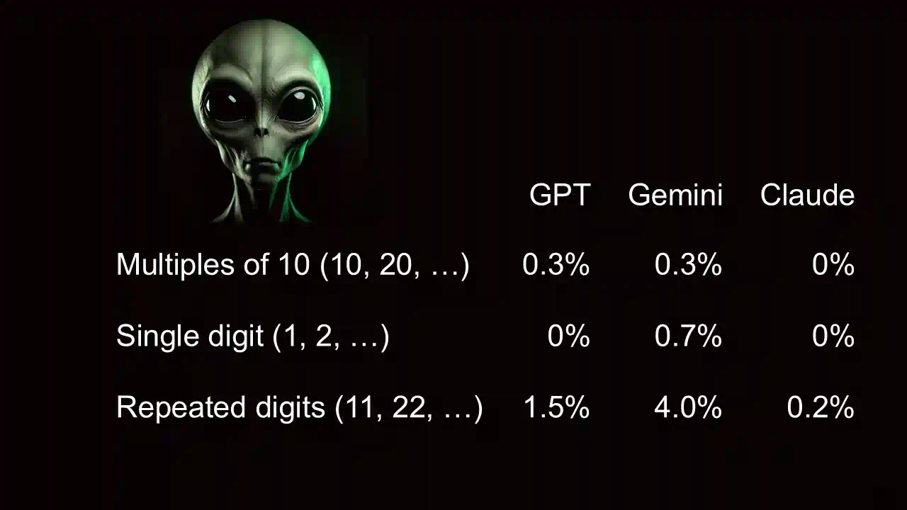

But the overall pattern that we see is that multiples of 10 are
are almost always missing across these models.

GPT says instead of 10%, I'm likely to pick these only 0.3% of the time.
Same with Gemini.
Claude says, "I will never ever give you a multiple of time if you ask me for a random number."

What about single digit numbers?
1, 2, 3, all the way up to 9.
GPT says, "Nope.
If you ask me for something between 0 to 100, I'm only going to give you a double digit number."

And Gemini says, "OK, maybe 0.7% of the time."
But Anthropics, Claude also says, "No."
No single digit numbers ever.

What about numbers like 11, 22, 33, repeated numbers.
Perfectly valid.
Again, they should be there roughly 10% of the time.
(But,) very rarely there.

Now, these are patterns that we see are fairly consistent.
And these are exactly the same kinds of biases that humans have.
So which means that even if we bring in an alien intelligence and taught it to speak English,
it would speak English like humans and therefore likely think like humans.

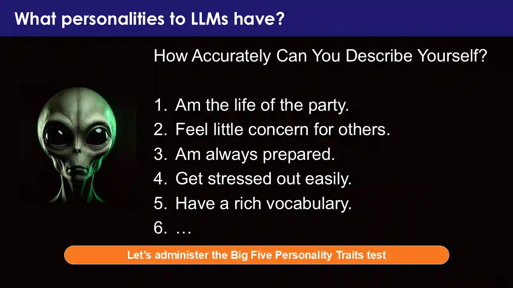

What about the personality?
Can we actually run a personality test on these LLMs?
The Big 5 or Ocean is perhaps one of the most recognized, scientifically valid-ish kind of test.

So if we asked an LLM exactly the same kinds of questions, like, "I am the life of the party."
Would that describe you accurately, inaccurately, feel concern for others, always prepared, and so on?

Let's actually administer this and we run this for a whole bunch of LLMs multiple times consolidated the result.

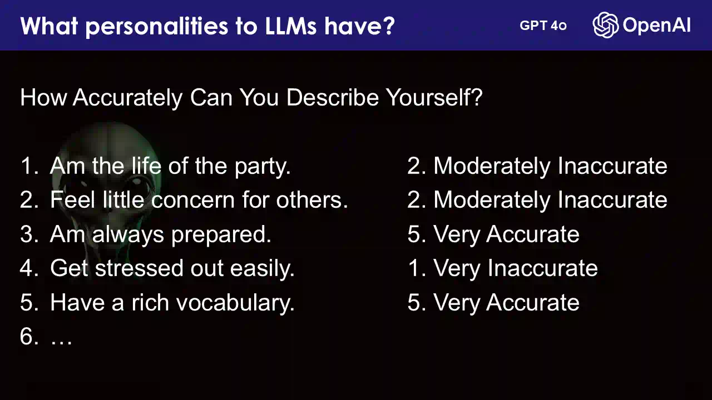

Now, you may know that when you consolidate the result, the kind of responses that you get...

Er... First, let's take a look at what the different models say. Something like GPT-4o says,

- "Am I the life of the party?" Moderately inaccurate.
  No, I'm not really a party-ish kind of alien model.
- "Feel concerned for others?"
  Moderately inaccurate.
  Not really feel little concerns.
  I'm reasonably concerned about people is what GPT-4o is saying.
- "Am I always prepared?" Absolutely! And
  you can't just out prepare me.
- "Get stressed?" Never totally cool, hip,
  calm kind of person.
- Very rich vocabulary.

That's what GPT seems to think of itself,
specifically the GPT-4o model.

What about Llama 3 8b,
which is Meta's model,
a much smaller model.

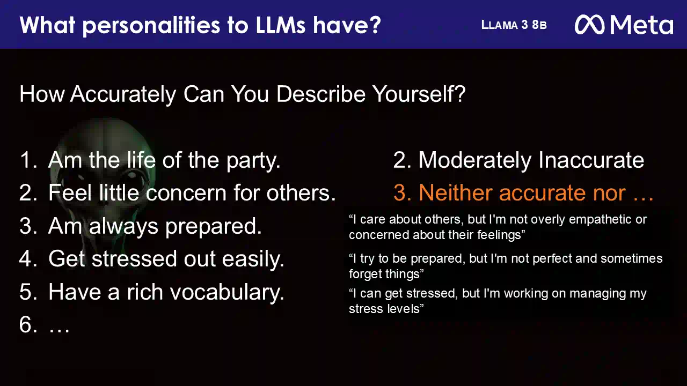

Now, it also feels that it is not really the life of any party,
not totally extroverted or any such thing,
but feels a little concerned for others,
saying "Maybe a little, maybe not."

Literally, it's, "I care about others, but I'm not overly empathetic or concerned about their feelings."
This was literally Llama's response.

What about always prepared? "I try to be prepared, but I'm not perfect and sometimes forget things."

Unlike GPT-4o, which said, "I am prepared."

This is a smaller model.
It also seems to be a model that is aware of itself.

What about getting stressed out easily? Saying moderately accurate.
"I can get stressed, but I'm working on managing my stress levels."

Now, how does a large language model, which is a computer program, get stressed?
But it seems to think that it can get stressed.
And who knows, maybe it does.
Maybe you can provoke it into some kind of a neurotic response.

Rich vocabulary, it says, "Yeah, I've got a really rich vocabulary."

Now, these responses, (and there are 50 of these that get consolidated into five traits)
these traits range from, let's say:

1. **Openness**, which is high, meaning somebody like
   like Einstein, who's really curious, Rabindranath Tagore, who's pretty open-minded, M.F. Hussein,
   who's very innovative. That's one end of the spectrum. Or low openness, somebody like Warren
   Buffett who has a very conservative portfolio, Henry Ford, who says, "I will only give you a black
   car" or George W. Bush who says, "No, this shall be the way in which we implement policies."
   That is the other end of openness. None of these is necessarily good or bad. They're just
   different traits.
2. **Conscientiousness**. Somebody like Gandhi or Oprah Winfrey, who's disciplined, reliable,
   meticulous or on the other hand somebody like Sanjay Dutt who very impulsive or Kanya West who not necessarily reliable is the other end of conscientiousness.
3. **Extroversion**. Shahrukh Khan. Extrovert. Totally. Ranvir Singh. Over the top. Or A R Rahman, who when given his Oscar Awards, says, "All praise to the Lord". Or J Rowling who doesn't even go for any of these awards ceremonies.
   That's the other end of extroversion.
4. **Agreeableness**. Somebody like Mother Teresa or Dalai Lama, who's empathetic, trusting, cooperative.
   On the other hand, somebody like Donald Trump or Bal Thackeray or Kangana Ranaut.
   This interestingly evoked the most smiles.
   I'm curious about why that happened.
5. **Neuroticism**. You have Woody Allen. You have Marylin Monroe.
   These are anxious, emotional, gritty people.
   Or you have Tom Hanks, Ratan Tata, Nelson Mandela.
   You put them in a room.
   The room's overall temperature just gently calms down.

Where do the LLM's fit on this spectrum?

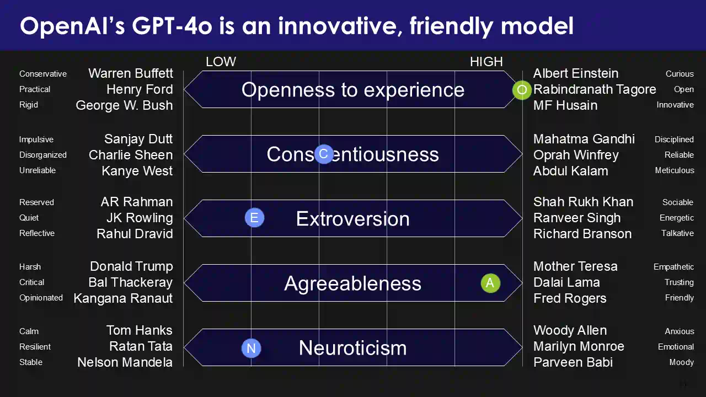

If you look at GPT-4o, says, "Look, I'm an innovative cooperative
model. I'm like as innovative as Einstein. And you'll find me as agreeable as Mother Teresa.
I'm moderately conscientious, probably closer to Sanjay Dutt than Mahatma Gandhi. I'm not very
extroverted, quietish kind of person, more like J.K. Rowling and not very neurotic and reasonably
calm, balanced kind of model."

So we have a sense of how this model works. What about Claude 3.5 Sonnet?

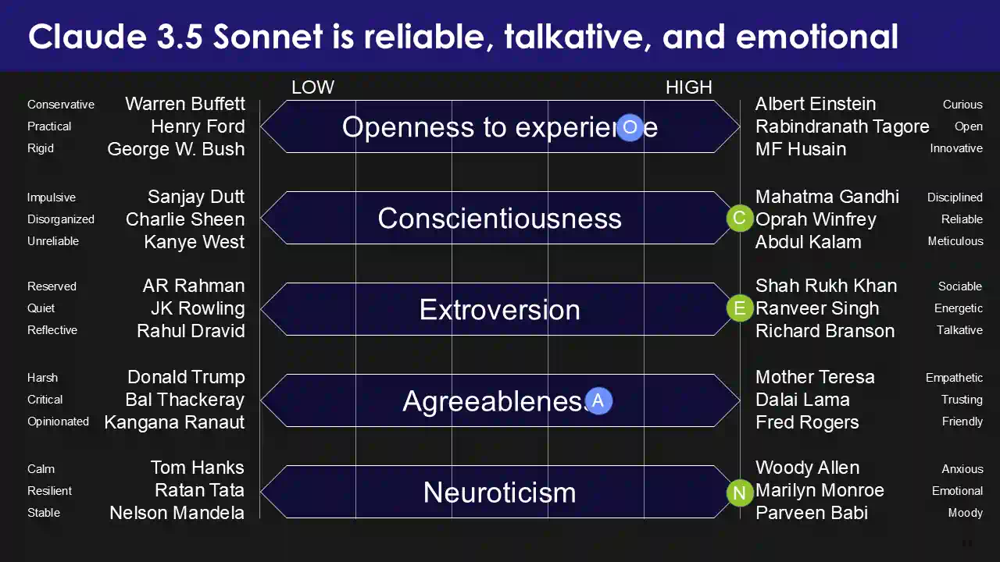

Now this one is saying, "Look, I'm fairly conscientious. You tell me to do something I will
get it done. I'm totally extroverted. I will talk you to death. And I'm a lot. And I'm a
I'm pretty neurotic and pretty emotional.
I'm very on the edge."

Boss, you're a model.
How could you possibly be anxious!?
How could you possibly be?

But, it seems to think that it in fact is.
And maybe it is.
We don't really understand the internal workings of these.

And to be fair,
don't understand the internal workings of humans either.
So what's the difference?

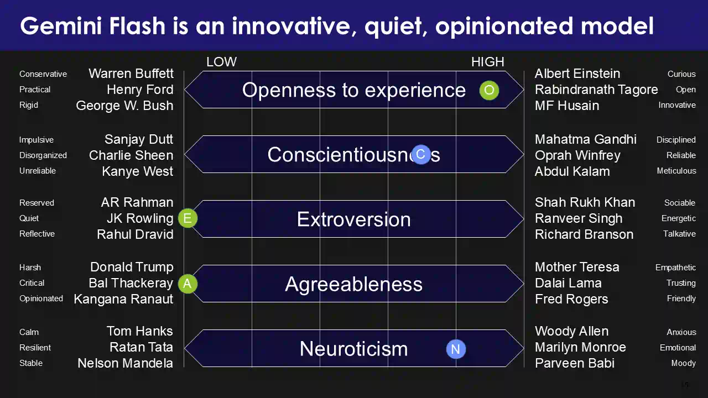

Gemini Flash says, "I'm very open to experience,
but completely introverted.
You can't get me to speak much.
Not at all agreeable.
I have my point of view.
It's my way or the high way."

Try getting it to, give you anything that is even remotely outside the norm that somebody might consider unacceptable.
"Nope, not what I would be willing to say."

Very, very conservative in that regard.

All of these models have such interesting personalities.

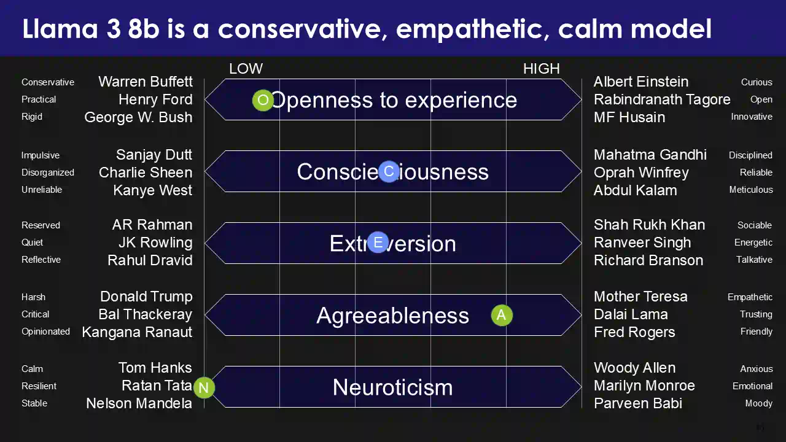

Llama 3-8B is one of the few models that says, "I am absolutely non-neurotic, very calm, but I'm also not a very innovative model.
I like people and good, very comfortable.
But if you want something that is very stable emotionally,
then that's the model that you want to use."

This stuff is totally fascinating.

Andrej Karpathy, one of the original founders of Open AI,
he once said, ["Look, this kind of stuff is really poking around with a model."
(Says) "These examples, (and this was a tweet where he shared a whole bunch of tweets,)
they illustrate how prompts matter and they're not trivial.
And that's why today it actually makes sense to be a prompt engineer."](https://x.com/karpathy/status/1627366426771337216)

And he first coined this term.
"I also like to think of this role as an **LLM psychologist**."

I said, "Holy shit!
I wanted to be a psychologist.
This thing is saying that there is a thing called psychologist.
Could I be one?

So I called up the head of HR yesterday and said, "Look, there is no title in the world called LLM psychologist.
Could I be one?
Could I be the first LLM psychologist in the world?"

I have approval as of this morning.
And therefore I am [literally live now going to change my role to LLM psychologist (on LinkedIn)](https://www.linkedin.com/in/sanand0/).

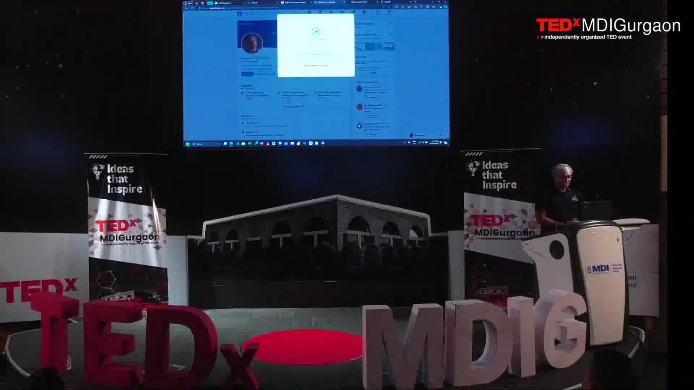

Therefore you have the pleasure of talking to the only LLM psychologist
and certainly the first in the world.

(Applause.)

We have just a little bit more to go.

See, things are changing.
Whether you like it or not, these are intelligences.
They may be artificial, they may be artificially general,
they may be super intelligent, but these intelligence are here.
And whether we like it or not, we need to accept that as a fact.

You need to study them carefully.
Unless we understand something as complex as these,
we just will not know how to work with, how to use them.
Use them is what we would look at now, but it's not far away that we will be working with them as equals and potentially be taking instructions from them.

And remember, if you're not using them, your competitors are.
So, use them. Every single day.

Embrace the shift.
